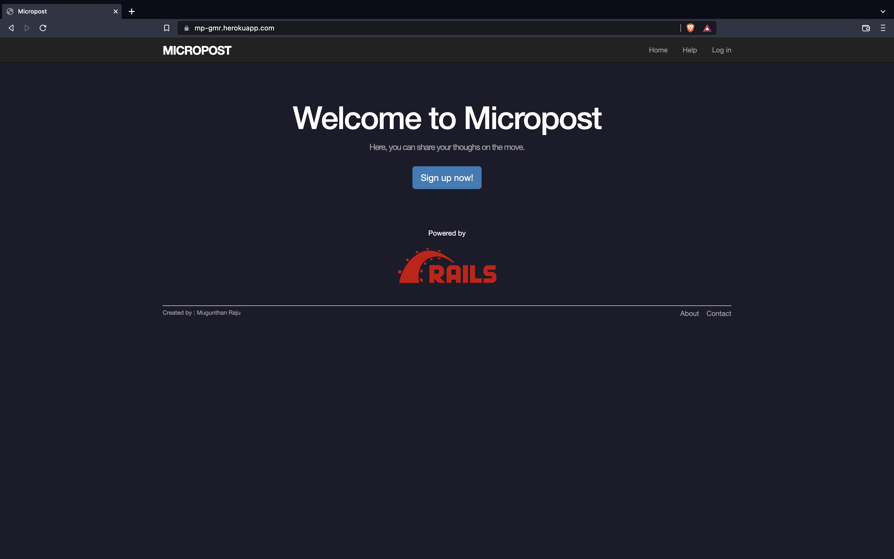

# Micropost Application

### Getting started

To get started with the app, clone the repo and then install the needed gems:
```
$ bundle install --without production
```
Next, migrate the database:
```
$ rails db:migrate
```
Finally, run the test suite to verify that everything is working correctly:
```
$ rails test
```
If the test suite passes, you'll be ready to run the app in a local server:
```
$ rails server
```

### Screenshot : Home Page

